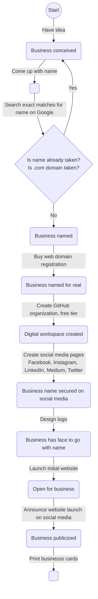

```mermaid
flowchart TB
    s0((Start)) -- Have idea --> s1(Business conceived)
    s1 -- Come up with name --> s2( )
    s2 -- Search exact matches for name on Google --> s3
    s3{Is name already taken?<br>Is .com domain taken?}
    s3 -- Yes --> s1
    s3 -- No --> s4(Business named)
    s4 -- Buy web domain registration --> s5(Business named for real)
    s5 -- Create GitHub organization, free tier--> s6(Digital workspace created)
    s6 -- Create social media pages<br>Facebook, Instagram, LinkedIn, Medium, Twitter --> s7(Business name secured on social media)
    s7 -- Design logo --> s8(Business has face to go with name)
    s8 -- Launch initial website --> s9(Open for business)
    s9 -- Announce website launch on social media --> s10(Business publicized)
    s10 -- Print businesss cards --> s11( )
```