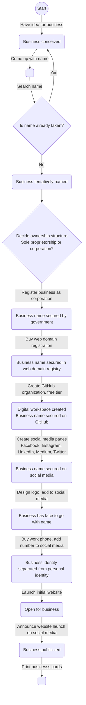

This pages describes the actions that were taken (or will be taken) to launch Ottawa Nerd Corp as a business. 

## Overview

## Naming
For those looking to start their own business, here are the main considerations when determining whether a business name is available:
* Search exact matches for name on Google
* Check if `.com` domain is available
* Check if business name is available in government registry

In the case of Ottawa Nerd Corp, I did the latter *after* having decided the name, registered the domain, made the social media accounts, etc. When I then tried to register the business as a sole proprietorship with my provincial government, I encountered an issue: only corporations can have the word `Corp` in their name.