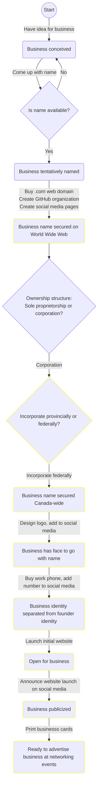
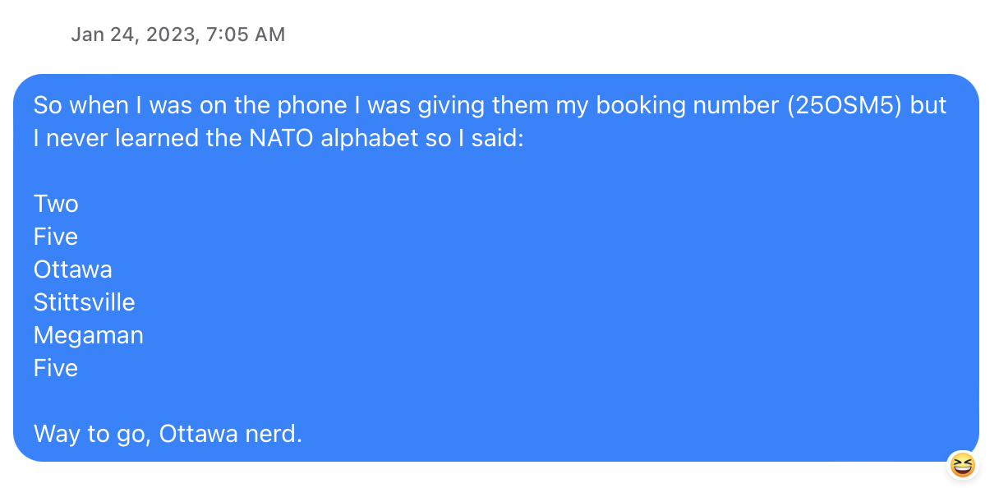

<!-- TODO: remove future tense --> This pages describes the steps that were taken—or will be taken—to launch Ottawa Nerd Corp as a business. 

## Overview
The following flowchart is a [state machine](https://en.wikipedia.org/wiki/Finite-state_machine) that shows how the business is evolving from an idea into a reality. It contains the following elements:<!-- TODO: past tense -->
* **Rounded box:** Represents a state of the business—past, present or future. Yellow boxes represent future states. 
* **Arrow:** Indicates an action required to take the business from one state to the next. 
* **Diamond:** Indicates an important decision to be made before taking the next step.

Some elements of this graph are explained in [Steps](#Steps) below.

<!-- TODO: Clean up state IDs -->

## Steps

### Have idea for business
After having spent about 4 years working for big companies in tech, I realized I wanted a job that:
1. Involved frequent interaction with clients
1. Required a generalized skillset where each day would we different
1. Didn't force me to work on things that I didn't think were worth working on
1. Didn't force me to rush unnecessarily and deliver work beneath my standards
1. Gave me the time to learn new skills within working hours rather than on my own time

It seemed like it would take years to find a tech job that would actually meet all these criteria and not just pay lip service to them in the interview stage. 

So I decided to create the job myself.

I didn't fully know what the business would be at that point. I just took it on faith that I could find people willing to pay me to solve their IT problems. The only question was if I could find enough people willing to pay enough money so that I could make a living out of it. There was only one way to find out.

### Come up with name
The business didn't become real to me until I had a name for it. The day I came up with it is the day I committed to making it a reality.

As Yuval Noah Harrari wrote in *Sapiens*, a company is nothing more and nothing less than a name.

The name Ottawa Nerd Corp was inspired by this story I wrote in a family chat about a phone call I had with Air Canada support:

Before this day, I had only vague daydreams of wanting to be self-employed. The minute I sent the above message though, the term `Ottawa nerd` and my daydreams came together like steel and flint, creating the spark of an actionable idea—buy `ottawanerdcorp.com` *now*.

The name appealed to me for several reasons:
1. **It's homourously self-aware.** 

    Computeer engineer, software developer, software engineer, IT consultant... The average non-tech person doesn't know or care what the difference is. They just want a computer nerd to solve their IT problems or build their app idea. I believe there is value in acknolwedging that and being relateable to those who need my skills but don't share my passion for infotech.

    I firmly believe there is room for humour in the infotech consulting world. A funny name makes the company memorable. I'll let the other guys do the job of being boring.

1. **It's composed of real words with unambiguous pronunciation**. 

    This is a win from a marketing perspective. If I say "Ottawa Nerd Corp" out loud to an Ottawaan audience there isn't any question of how to Google that.
    
    I briefly considered Ottawa Nerd Corps as the name. As in "Marine Corps." An army of nerds at your disposal! ...The only problem is that "corps" has a homophone in "core". Nerd Corps could easily be misinterpreted as "Nerd Core" when said aloud.

   ...I've never been a fan of company names that are just random noises that sound like they could be words.

1. **It reframes nerdiness as a positive trait.**

    The world needs more people who are passionate about STEM topics. Nerdiness should be encouraged and celeberated.

1. **It leaves room for growth.**

    Though the business is starting as an infotech firm, there's no reason why it couldn't someday expand into other tech fields, such as biotech.

    Even to be be successful in infotech, one needs experts (nerds) from other walks of life. Try building a good medical app without medical science nerds. Try building a good e-commerce app without business nerds. Technical skills alone are not enough.

1. **It's a reference to fictional companies such as Oscorp and LexCorp.**
   
   Fitting, for a company of self-proclaimed nerds.

The name did create a slight problem: in Canada only corporations can legally use the abbreviation `Corp` in their business name. This is causing me to incorporate much sooner than would be advisable in the current situation—at this point the business is still a one-man shop with no sales and no liability. Surely the wiser decision—the one suggested to me by friends and family—was to simply choose a different name?<!-- TODO: past tense -->

However, as the CEO and sole shareholder of my own company I believe I am entitled to make inadvisable decisions if I consider them to be in the company's best interest. 

Taking into consideration the above points, no proposed other alternatives are as satisfying as `Ottawa Nerd Corp`. I therefore contend that overhead of incorporation is worth it to have the name I want.

A company is, as Yuval Harrarri said, only as good as its name. <!-- TODO: get actual quote >

<!-- TODO
### Is name available?
For those looking to start their own business, here are the main considerations when determining whether a business name is available:
* Search exact matches for name on Google
* Check if `.com` domain is available
* Check if business name is available in government registry

In the case of Ottawa Nerd Corp, I did the latter *after* having decided the name, registered the domain, made the social media accounts, etc. When I then tried to register the business as a sole proprietorship with my provincial government, I encountered an issue: only corporations can have the word `Corp` in their name. 

### Create social media pages
Facebook, Instagram, LinkedIn, Medium, Twitter 
-->
