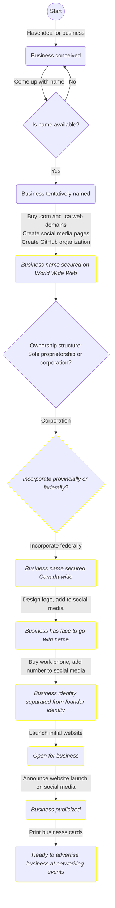

<!-- TODO: remove future tense --> This pages describes the steps that were taken—or will be taken—to launch Ottawa Nerd Corp as a business. It serves two main purposes:
* Documenting the early days of the company for historical purposes
* Helping me think through each step as I take it

I'm also hoping that this may help others start their own business—a prospect many find daunting but can in fact be will within reach.

## Overview
The following flowchart is a [state machine](https://en.wikipedia.org/wiki/Finite-state_machine) that shows how the business is evolving from an idea into a reality. It contains the following elements:<!-- TODO: past tense -->
* **Rounded box:** Represents a state of the business—past, present or future. Boxes with yellow outlines and italic text represent future states. 
* **Arrow:** Indicates an action required to take the business from one state to the next. 
* **Diamond:** Indicates an important decision to be made before taking the next step.

Some elements of this graph are explained in the [Steps](#Steps) section below. This section describes how I went about executing each step, and reflects on things I wish I had done differently.

This graph should **not** be used as a map for others looking to start their own business. Those who do would do well to read my regrets in the following section.

<!-- TODO: Clean up state IDs -->

## Steps

### Have idea for business
After having spent about 4 years working for big companies in tech, I realized I wanted a job that:
1. Involved frequent interaction with clients
1. Required a generalized skillset where each day would we different
1. Didn't force me to work on things that I didn't think were worth working on
1. Didn't force me to rush unnecessarily and deliver work beneath my standards
1. Gave me the time to learn new skills within working hours rather than on my own time

It seemed like it would take years to find a tech job that would actually meet all these criteria and not just pay lip service to them in the interview stage. 

So I decided to create the job myself.

I didn't fully know what the business would be at that point. I just took it on faith that I could find people willing to pay me to solve their IT problems. The only question was if I could find enough people willing to pay enough money so that I could make a living out of it. There was only one way to find out.

### Come up with name
The business didn't become real to me until I had a name for it. The day I came up with it is the day I committed to making it a reality.

As Yuval Noah Harrari wrote in *Sapiens*, a company is nothing more and nothing less than a name.

The name Ottawa Nerd Corp was inspired by this story I wrote in a family chat about a phone call I had with Air Canada support:

Before this day, I had only vague daydreams of wanting to be self-employed. The minute I sent the above message though, the term `Ottawa nerd` and my daydreams came together like steel and flint, creating the spark of an actionable idea—buy `ottawanerdcorp.com` *now*.

The name appealed to me for several reasons:
1. **It's homourously self-aware.** 

    Computeer engineer, software developer, software engineer, IT consultant... The average non-tech person doesn't know or care what the difference is. They just want a computer nerd to solve their IT problems or build their app idea. I believe there is value in acknowledging that and being relatable to those who need a techie's skills but don't share their passion for tech.

    I firmly believe there is room for humour in the infotech consulting world. A funny name makes the company memorable. I'll let the other guys do the job of being boring.

1. **It's composed of real words with unambiguous pronunciation**. 

    This is a win from a marketing perspective. If I say "Ottawa Nerd Corp" out loud to an Ottawaan audience there isn't any question of how to Google that.
    
    I briefly considered Ottawa Nerd Corps as the name. As in "Marine Corps." An army of nerds at your disposal! ...The only problem is that "corps" has a homophone in "core". Nerd Corps could easily be misinterpreted as "Nerd Core" when said aloud.

   ...I've never been a fan of company names that are just random noises that sound like they could be words.

1. **It reframes nerdiness as a positive trait.**

    The world needs more people who are passionate about STEM topics. Nerdiness should be encouraged and celeberated.

1. **It leaves room for growth.**

    Though the business is starting as an infotech firm, there's no reason why it couldn't someday expand into other tech fields, such as biotech.

    Even to be be successful in infotech, one needs experts (nerds) from other walks of life. Try building a good medical app without medical science nerds. Try building a good e-commerce app without business nerds. Technical skills alone are not enough.

1. **It's a reference to fictional companies such as Oscorp and LexCorp.**
   
   Fitting, for a company of self-proclaimed nerds.

### Is name available?
To determine whether `Ottawa Nerd Corp` was available, I started by:
1. Checking if `ottawanerdcorp.com` was available on [Google Domains](https:///domains.google)
2. Searching on Google, both for exact matches and just as keywords (`"ottawa nerd corp"` and `ottawa nerd corp`)
3. Searching in the [Ontario Business Registry](https://www.ontario.ca/page/ontario-business-registry)

Perhaps the search should have included a [Nuans](https://ised-isde.canada.ca/site/nuans-corporate-name-trademark-reports/en) report but it didn't seem worth it at the time. I was already planning to incorporate by that point—a  Nuans search is included in the process.

One very important thing I neglected to consider was whether the business name was *legal*. 

As it turns out, a business in Ontario (probably anywhere in Canada) cannot have the word `Corp` in it (or `Inc.` or `Ltd.`) unless it is a corporation. I found this out when I tried to register the business as a sole propiertorship online.

A Google search led me to [Ontario Regulation 399/21](https://www.ontario.ca/laws/regulation/r21399). Section 7 states:

> A name shown in a registration shall not use a word or expression that would suggest that the registrant is a form of organization that the registrant is not.

...Fair enough. I guess I should have anticipated that.

Herein lay my first dilemma. Incorporating just to be able to use "Corp" in the business name sounds like a bad idea. But registering as a sole proprietor would mean giving up on the name that I firmly believed was most optimal for the business.

In the end I decided to incorporate, as explained [below](#ownership-structure-sole-proprietorship-or-corporation). So far I haven't regretted that decision. What I *would* do differently is register the business *before* committing to any name by buying web domains, creating social media accounts, etc.

### Buy `.com` and `.ca` web domain
It was important to me that the business have a `.com` website. Not `.co`, not `.net`, and *definitely* not `.xyz`.

I don't have the data to back this up, but these other gTLDs seem like they would be suboptimal from a marketing perspective. It seems to me like the average person expects a website to end with `.com` or the ccTLD of their country. Anything else I think would be generally perceived as odd and perhaps less legitimate.

I also purchased `ottawanerdcorp.ca` for good measure. It seemed like something someone might type in their address bar.

In hindsight, I wish I had confirmed the business name with the government before purchasing the domain, in case the government decided I couldn't use it. At the time, I was just excited about getting started. The domain was a low-hanging fruit.

### Create GitHub organization
Any infotech company worth their salt should at least *reserve* their name on GitHub, if not use it.

### Create social media pages
To guarantee the business had a proper web presence (and didn't have its name stolen by trolls), I made accounts on all the social media sites that the company could conceivably use for marketing and/or knowledge sharing:

<!-- TODO: Link all pages --> 
* Facebook
* Instagram
* LinkedIn
* Medium
* Twitter

### Ownership structure: Sole proprietorship or corporation?
As mentioned above, the business had to be incoporated in order to use `Ottawa Nerd Corp` as a name.

I acknowledge that this is a rather silly reason to incorporate, given the overhead involved in doing so. As a one-man shop with no sales nor liability (yet), I was advised by several people to register as a sole proprietor and simply choose a different business name.

However, I really did believe that Ottawa Nerd Corp was the best possible name for my business, for the reasons stated [above](#come-up-with-name). I suppose time will tell whether there's any truth to that, or if it was just my pride talking.

