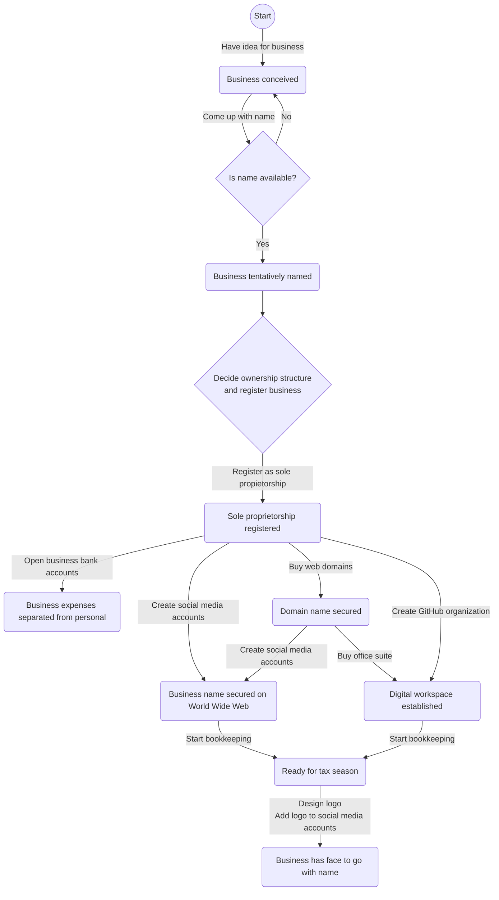
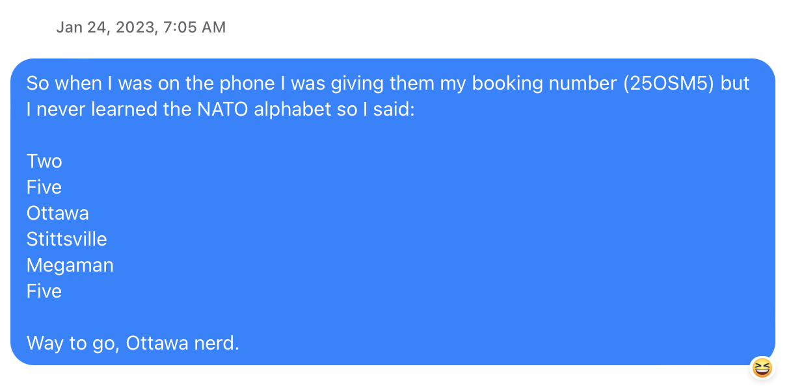
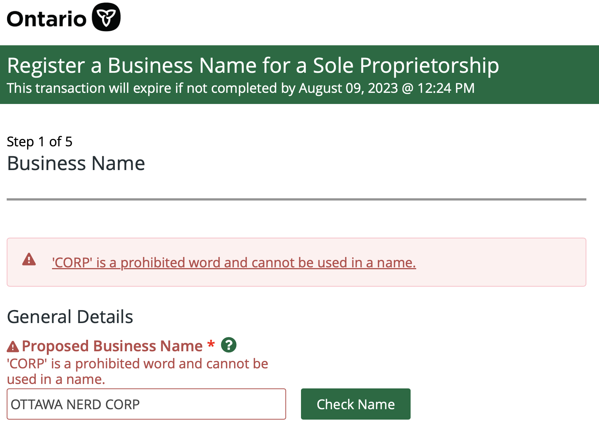

This document serves to record the development of Ottawa Tech Nerds as a business. Whether the business succeeds or fails, the hope is that having a written record of what happened will help inform future business endeavors. At the very least, we can use it as source material for talks or blog articles.

The document thus contains two sections. [What Should've Happened](#what-shouldve-happened) consists of a flowchart representing what we think would have been the ideal path for us to take. This is based on what we learned from [What Actually Happened](#what-actually-happened), which is a description of how the business actually developed, the mistakes that were made, and what wish we had done differently.

- [What Should've Happened](#what-shouldve-happened)
- [What Actually Happened](#what-actually-happened)
  - [Have idea for business](#have-idea-for-business)
  - [Come up with name](#come-up-with-name)
  - [Is name available?](#is-name-available)
  - [Decide ownership structure](#decide-ownership-structure)
  - [Register as sole propietorship](#register-as-sole-propietorship)
  - [Open business bank accounts](#open-business-bank-accounts)
  - [Buy web domains](#buy-web-domains)
  - [Create social media accounts](#create-social-media-accounts)
  - [Create GitHub organization](#create-github-organization)
  - [Buy office suite](#buy-office-suite)
  - [Start bookkeeping](#start-bookkeeping)
  - [Design logo](#design-logo)

## What Should've Happened
The following flowchart shows an idealized version of how I think the business *should* have evolved. 

The diagram contains the following elements:
* **Rounded boxes** represent thestate of the business.
* **Arrow:** Indicates an action required to take the business from one state to the next. 
* **Diamond:** Indicates an important decision to be made before taking the next step.

Elements of this graph are described in further detail in the next section.

## What Actually Happened

### Have idea for business
After having spent about 4 years working in tech deparments of large corporations, I realized I wanted a job that:
1. Involved frequent interaction with clients
2. Required a generalized skillset where each day would be different
3. Didn't force me to work on things that I didn't think were worth working on
4. Didn't force me to rush unnecessarily and deliver work beneath my standards
5. Gave me the time to learn new skills within working hours rather than on my own time

I felt it would take years of searching to find a tech job that would actually meet all these criteria and not just pay lip service to them in the interview stage. So I decided to create the job myself.

I didn't fully know what the business would be at that point. I just took it on faith that I could find people willing to pay me to solve their IT problems; that I could find likeminded people who would be willing to work with me to solve these problems. The only question was if I could find enough people willing to pay enough money for the business to be a sustainable source of income. The only way to find out was to try.

### Come up with name
The business didn't become real to me until I had a name for it. The day I came up with it is the day I committed to making the business a reality.

As Yuval Noah Harrari wrote in *Sapiens*, a company is nothing more and nothing less than a name.

At first the name of the company was Ottawa Nerd Corp. I had to change it to Ottawa Tech Nerds for legal reasons (see below) but I hope to someday go back to the original name for the following reasons:

1. **It's homourously self-aware.** 

    Computeer engineer, software developer, software engineer, IT consultant... The average non-tech person doesn't know or care what the difference is. They just want a computer nerd to solve their IT problems or build their app idea. I believe there is value in acknowledging that and being relatable to those who need a techie's skills but don't share their passion for tech.
 
    I firmly believe there is room for humour in the infotech consulting world. A funny name makes the company memorable. I'll let the other guys do the job of being boring.

 2. **It's composed of real words with unambiguous pronunciation**. 

    This is a win from a marketing perspective. If I say "Ottawa Nerd Corp" out loud to an Ottawaan audience there isn't any question of how to Google that.
  
    I briefly considered Ottawa Nerd Corps as the name. As in "Marine Corps." An army of nerds at your disposal! ...The only problem is that "corps" has a homophone in "core". Nerd Corps could easily be misinterpreted as "Nerd Core" when said aloud.

    ...I've never been a fan of company names that are just random noises that sound like they could be words.
 
3. **It reframes nerdiness as a positive trait.**
 
     The world needs more people who are passionate about STEM topics. Nerdiness should be encouraged and celeberated.
 
4. **It leaves room for growth.**

    Though the business is starting as an infotech firm, there's no reason why it couldn't someday expand into other tech fields, such as biotech.
 
    Even to be be successful in infotech, one needs experts (nerds) from other walks of life. Try building a good medical app without medical science nerds. Try building a good e-commerce app without business nerds. Technical skills alone are not enough.

5. **It's a reference to fictional companies such as Oscorp and LexCorp.**
    
    Fitting, for a company of self-proclaimed nerds.

Ottawa Tech Nerds was the closest alternative I could come up with. It hits all the points except 5, which is a shame from a marketing perspective, but it'll do for now.

Ottawa Nerd Corp was inspired by this story I wrote in a family chat about a phone call I had with Air Canada support:

### Is name available?
I followed these steps to determine the availibility of the business name.

1. **Search for `.com` domain availibility and pricing.**

    Ideally your country's ccTLD (`.ca` for us here in Canada) should be available as well.

    If the `.com` domain is unavailable or out of your price range, your business will probably be fighting an uphill battle when it comes to marketing. The average person expects a website to end with `.com` or the ccTLD of their country. If you use a different gTLD, your customers might still go to the `.com` site by mistake. Also, certain newer gTLDs like `.xyz` may be perceived as odd or less legitimate, especially when heard aloud. 

2. **Search name on Google**

    Search using both keywords an exact match (e.g. `ottawa tech nerds` and `"ottawa tech nerds"`). The exact match search will tell you whether the name is already being used elsewhere. The keyword search will allow you to determine who you'll be competing with for SEO when someone types your company's name.

3. **Search in business registry**

    For us this was the [Ontario Business Registry](https://www.ontario.ca/page/ontario-business-registry).

These steps should be enough to *tentatively* set the business name, but you can't be sure until the business is actually registered. In hindsight, I should've waited until after registration to [buy the domain](#buy-web-domains)

 *[Ontario Regulation 399/21](https://www.ontario.ca/laws/regulation/r21399) Section 7 states: "A name shown in a registration shall not use a word or expression that would suggest that the registrant is a form of organization that the registrant is not." ...So you can't use the word "Corp" in your business name unless you're registering as a corporation. Oops.* 

### Decide ownership structure

I briefly considered incorporation so that I could keep the original Nerd Corp name, but ultimately decided I couldn't justify the cost. Accounting fees were the main blocker. Accountants charge anywhere between $1,000 to $2,000 CAD for filing corporate tax returns, and up to $500 for nil returns. I simply couldn't afford this until I proved the viability ofthe business and made enough revenue to benefit from corporate tax rates.

If corportate taxes were simpler for laymen to do, I probably would have incorporated using [Ownr](ownr.co).

### Register as sole propietorship

Ottawa Tech Nerds was registered as a sole proprietorship in the province Ontario. This was done [online](https://www.ontario.ca/page/business/start/register-your-business-online) and cost $60. The process was straightforward and painless.

### Open business bank accounts

Having registered the business, I was now able to open bank accounts for it. Though I didn't strictly need a business account to start making purchases for my business, the sooner I started making expenses on a separate account, the easier the bookkeeping would be for me later.

Ottawa Tech Nerds has a debit and credit account through the Bank of Montreal. BMO was selected due to its [direct feeds](https://central.xero.com/s/article/BMO-direct-feeds) integration with Xero, my desired bookkeeping software. Of all the Canadian banks supporting direct feeds, BMO was the only one with $0 monthly fee debit and credit accounts.

The registration process was slower than what I was used to with consumer accounts, especially for the credit card. I wasn't particularly impressed with BMO–on multiple occasions the process was stalled due to system failures. In all it took over a month and four phone calls to get set up with small business debit and credit accounts at BMO. Their online banking system has a poor, dated UX. Transaction alerts do not appear to be suppported for business accounts. All in all, I would not recommend BMO for business accounts and may consider switching to a different bank in the future.

It seems likely that even with a better bank, the process would have at least taken a couple weeks. In the meantime it would have made sense to complete some of the other steps below, like [buying domain names](#buy-web-domains) and [creating social media accounts](#create-social-media-accounts), had I not already done those things prematurely...

### Buy web domains
Buying `ottawanerdcorp.com` was actually the first thing I did when I came up with the idea and name for the business. In hindsight this was premature. Once I found out during the business registration that I couldn't use the word "Corp" in a sole prietorship, I had to buy another domain.

It was important to me that the business have a `.com` website. Not `.co`, not `.net`, and *definitely* not `.xyz`.

I also purchased `ottawanerdcorp.ca` for good measure. It seemed like something someone might type in their address bar.

### Create social media accounts
To guarantee the business had a proper web presence (and didn't have its name stolen by trolls), I made accounts on all the social media sites that the company could conceivably use for marketing and/or knowledge sharing:
* Facebook
* Instagram
* LinkedIn
* Medium
* Twitter

### Create GitHub organization<!-- TODO -->

### Buy office suite<!-- TODO -->

### Start bookkeeping<!-- TODO -->

### Design logo<!-- TODO -->
